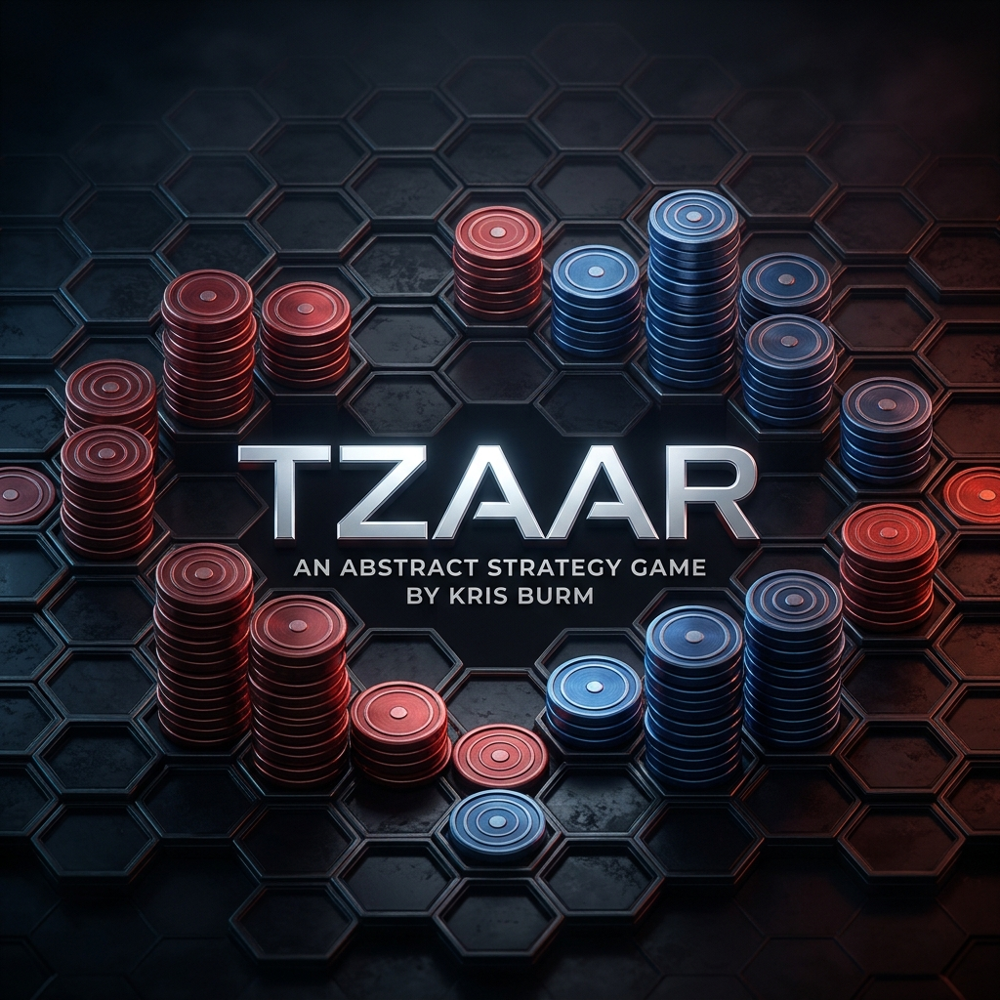

# TZAAR



**TZAAR** est un jeu de stratégie abstrait captivant pour deux joueurs, implémenté pour la plateforme CodinGame. Il s'agit d'une adaptation d'un des jeux classiques du Projet GIPF.

Le but du jeu est de capturer le dernier pion TZAAR, TZARRA ou TOTT de l'adversaire, ou de le mettre dans l'incapacité d'effectuer une capture valide à son premier coup. 

## Structure du Jeu

- Le code source du jeu (`Referee`, `Board`, `Viewer`) se trouve dans `src/main/java/com/codingame/game`.
- L'énoncé officiel (Règles FR et EN) est disponible dans `config/`.
- Un Bot ultra-rapide (Alpha-Beta Minimax) est fourni dans `config/Boss.java` pour tester l'intelligence de vos IAs en local.

## Démarrage rapide en local

```powershell
javac config/Boss.java
mvn clean install
mvn exec:exec -D"exec.executable"="java" -D"exec.classpathScope"="test" -D"exec.args"="--add-opens java.base/java.lang=ALL-UNNAMED -cp %classpath Main"
# -> Rendez-vous ensuite sur http://localhost:8888/test.html
```
